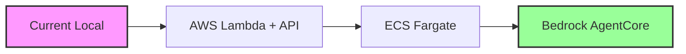

# Bedrock AgentCore Setup for Fantasy Draft Assistant

## Current Status

**Date**: August 6, 2025  
**Status**: Environment Setup Phase

### ✅ Completed
- [x] AWS CLI configured (Account: YOUR_AWS_ACCOUNT_ID)
- [x] Region: us-east-1
- [x] Development environment structure created
- [x] Requirements file prepared
- [x] IAM setup scripts created
- [x] Proof of concept agent (recommendation_agent.py)

### ⚠️ Required Actions

#### 1. Enable Amazon Bedrock in AWS Account
Your AWS account needs Bedrock access enabled:

1. **Enable Bedrock Models**:
   ```bash
   # Go to AWS Console > Bedrock > Model access
   # Request access to Anthropic Claude models
   # This may take a few minutes to activate
   ```

2. **Update IAM Permissions**:
   Your current IAM user (`rubinsky-website-deploy`) needs Bedrock permissions.
   
   Option A: Add inline policy to your user:
   ```json
   {
     "Version": "2012-10-17",
     "Statement": [
       {
         "Effect": "Allow",
         "Action": [
           "bedrock:*"
         ],
         "Resource": "*"
       }
     ]
   }
   ```
   
   Option B: Run the IAM setup script (requires admin permissions):
   ```bash
   ./scripts/setup_iam.sh
   ```

#### 2. Hybrid Deployment Approach
While waiting for Bedrock activation, we'll use a hybrid approach:

- **Phase 1**: Use Anthropic API directly (current implementation)
- **Phase 2**: Deploy to AWS Lambda/ECS with direct API
- **Phase 3**: Migrate to Bedrock when available

### 📁 Project Structure

```
bedrock-agentcore/
├── agents/                  # Agent implementations
│   └── recommendation_agent.py  # POC agent
├── infrastructure/          # AWS CloudFormation/CDK
├── scripts/                 # Setup and deployment scripts
│   ├── setup_environment.sh    # Environment setup
│   ├── setup_iam.sh           # IAM roles creation
│   └── deploy_hybrid.sh       # Hybrid deployment (coming)
├── config/                  # Configuration files
└── requirements.txt         # Python dependencies
```

### 🚀 Quick Start (Hybrid Approach)

1. **Set up Python environment**:
   ```bash
   cd bedrock-agentcore
   python3 -m venv venv
   source venv/bin/activate
   pip install -r requirements.txt
   ```

2. **Configure environment**:
   ```bash
   cp ../.env.local ../.env.bedrock
   # Edit .env.bedrock with your keys
   ```

3. **Test the agent locally**:
   ```bash
   python agents/recommendation_agent.py
   ```

4. **Deploy hybrid solution**:
   ```bash
   ./scripts/deploy_hybrid.sh  # Coming next
   ```

### 🔄 Migration Path



### 📊 Deployment Options Comparison

| Feature | Direct Lambda | ECS Fargate | Bedrock AgentCore |
|---------|--------------|-------------|-------------------|
| **Setup Complexity** | Low | Medium | High |
| **Cost** | $0.20/1M requests | ~$30/month | Pay per use |
| **Scalability** | Auto | Auto | Auto |
| **WebSocket Support** | Via API Gateway | Native | Via Gateway |
| **MCP Support** | Custom | Custom | Native |
| **Multi-Agent** | Manual | Manual | Native |
| **Time to Deploy** | 1 hour | 2 hours | 1 day |

### 🎯 Immediate Next Steps

1. **For Quick Deployment** (Today):
   - Deploy current app to AWS Lambda
   - Use API Gateway for WebSocket
   - Continue using Anthropic API directly

2. **For Production** (This Week):
   - Set up ECS Fargate cluster
   - Deploy containerized application
   - Add CloudFront CDN

3. **For Future** (When Ready):
   - Enable Bedrock in account
   - Migrate agents to AgentCore
   - Leverage native MCP support

### 📝 Notes

- Bedrock AgentCore is ideal for long-term architecture
- Hybrid approach gets us deployed immediately
- Can migrate incrementally without disruption
- Cost-effective path forward

### 🔗 Resources

- [AWS Bedrock Documentation](https://docs.aws.amazon.com/bedrock/)
- [Bedrock AgentCore Samples](https://github.com/awslabs/amazon-bedrock-agentcore-samples)
- [AWS Well-Architected Framework](https://aws.amazon.com/architecture/well-architected/)

---

*Last Updated: August 6, 2025*